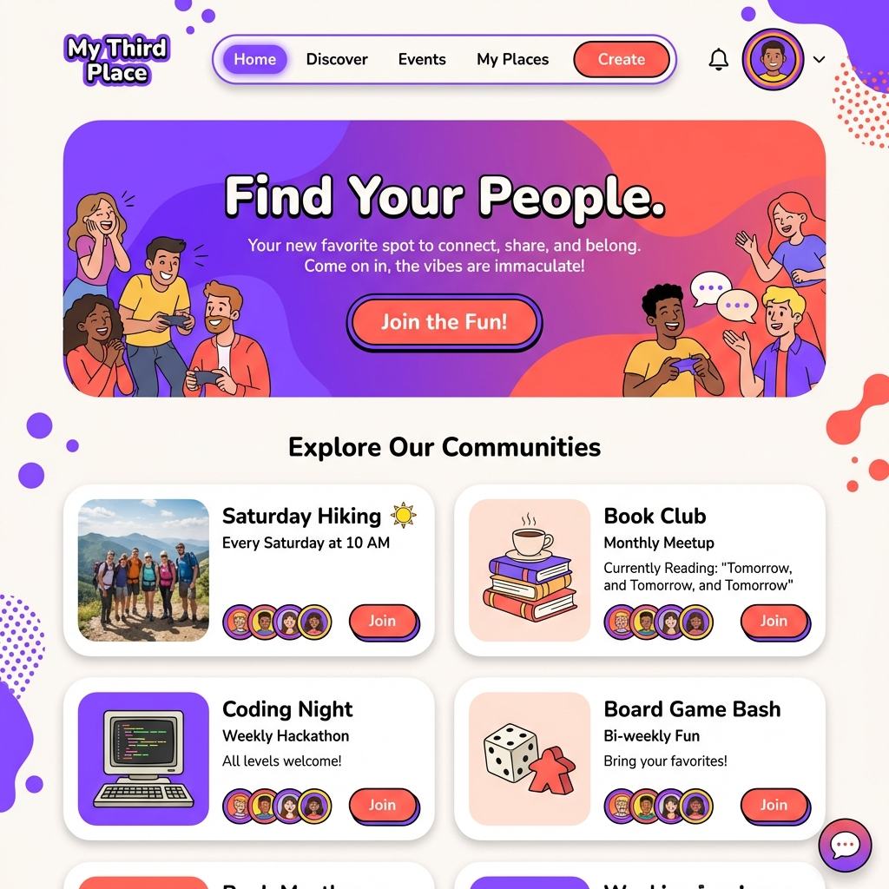
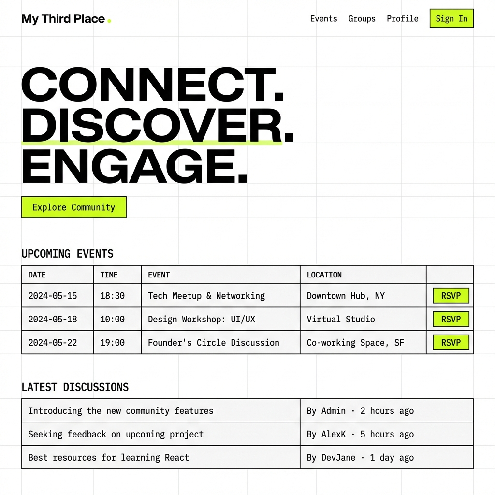
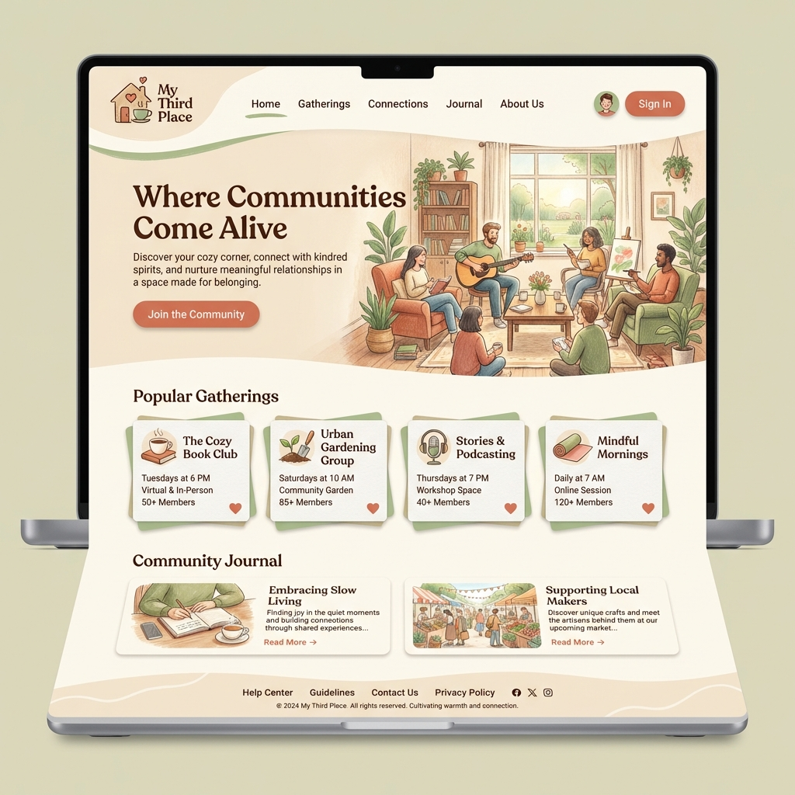
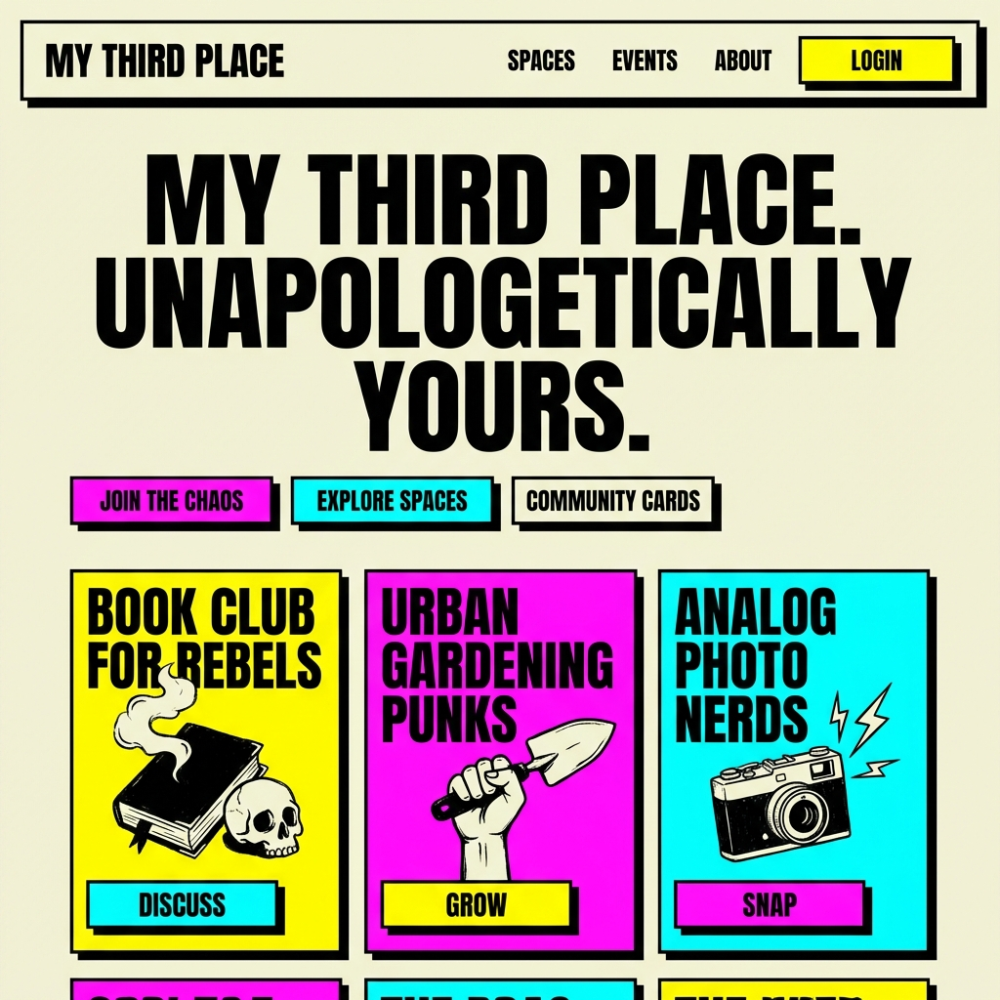
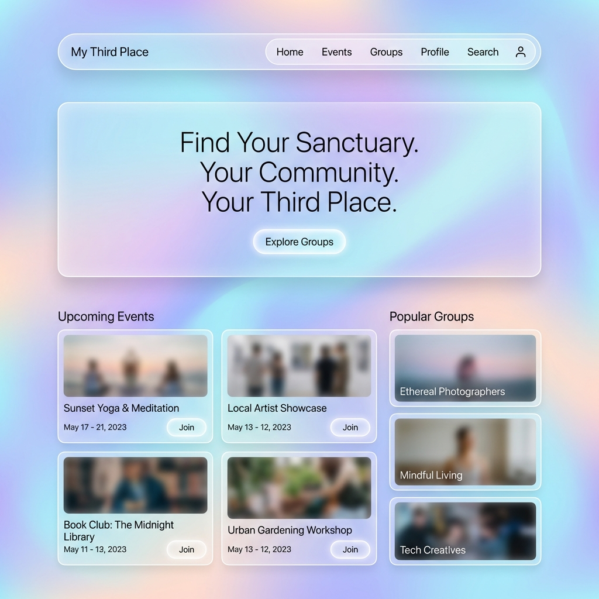

# UI Theme Options

This document outlines three proposed design directions for the "My Third Place" UI revamp.

## 1. Vibrant Community
*Playful, energetic, and social.*
- **Keywords**: Fun, Dynamic, Welcoming.
- **Inspiration**: Discord, Duolingo.
- **Colors**: Electric Violet, Bright Coral.

## 2. Modern Minimalist
*Clean, structured, and professional.*
- **Keywords**: Fast, Clear, Efficient.
- **Inspiration**: Linear, Vercel, Notion.
- **Colors**: Monochrome (Black/White), Neon Lime Accent.

## 3. Cozy Third Place
*Warm, organic, and inviting.*
- **Keywords**: Comfort, Connection, Belonging.
- **Inspiration**: Kinfolk, Local Coffee Shops.
- **Colors**: Terracotta, Sage Green, Warm Cream.

## 4. Neo-Brutalism
*Bold, trendy, and raw.*
- **Keywords**: Unapologetic, High Contrast, Honest.
- **Inspiration**: Gumroad, Figma.
- **Colors**: Beige/White Background, Clashing Pink/Cyan Accents.

## 5. Ethereal Glass
*Light, airy, and futuristic.*
- **Keywords**: Calm, Premium, Translucent.
- **Inspiration**: macOS Big Sur, visionOS.
- **Colors**: Pastels, Soft Gradients, Frosted Glass.

